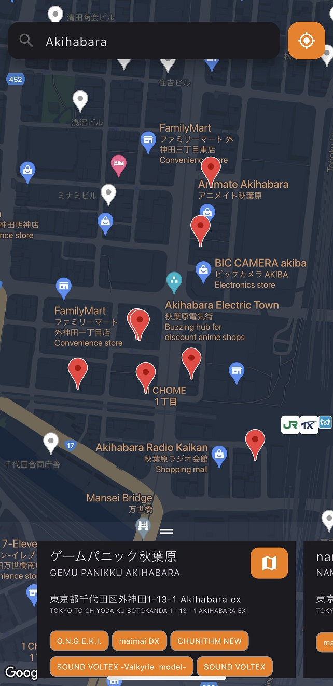

# Otoge Mobile App - Music Games Locator

> An Android / iOS mobile application to locate arcade music games near you.

  

## Getting Started

Get the project up and running on your mobile device or emulator in just a couple of minutes!

1. Ensure you have [Flutter](https://flutter.io) installed.
2. Ensure you have [Google Map API Key](https://developers.google.com/maps/documentation/android-sdk/get-api-key) configured.
3. Ensure you have your device or emulator prepared to [run the project](https://docs.flutter.dev/get-started/test-drive).
4. Clone the repository.
5. Rename the `.env.sample` file to `.env`.
6. Open `.env` and insert your Google Maps API key to the `GOOGLE_MAPS_API_KEY`.
7. Run `flutter run` to run the application.

## Attribution

Special thanks to [DJZMO](https://github.com/djzmo) for inventing the original [otoge.app](https://otoge.app).
